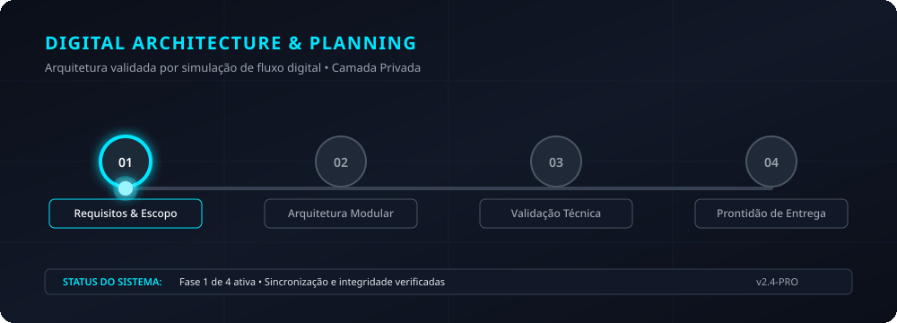

# Planejamento: interface de plataforma educacional

> **Status:** planejamento privado. Não inclui instalação de LMS, migração de banco de dados ou acesso a servidores.

## Objetivo

Desenhar a experiência de uma plataforma de cursos com navegação por trilhas, aulas, progresso e avaliações, preservando a separação entre conteúdo, interface e administração.

## Fluxos previstos

O aluno acessa o painel, abre módulos, consulta aulas, realiza atividades e acompanha progresso. O administrador organiza conteúdos e usuários em uma área separada. Integrações com LMS, banco de dados e hospedagem exigem análise técnica própria.

## Critérios de aceite

Os fluxos principais funcionam em celular e desktop, com estados claros para progresso, conteúdo indisponível e suporte.
